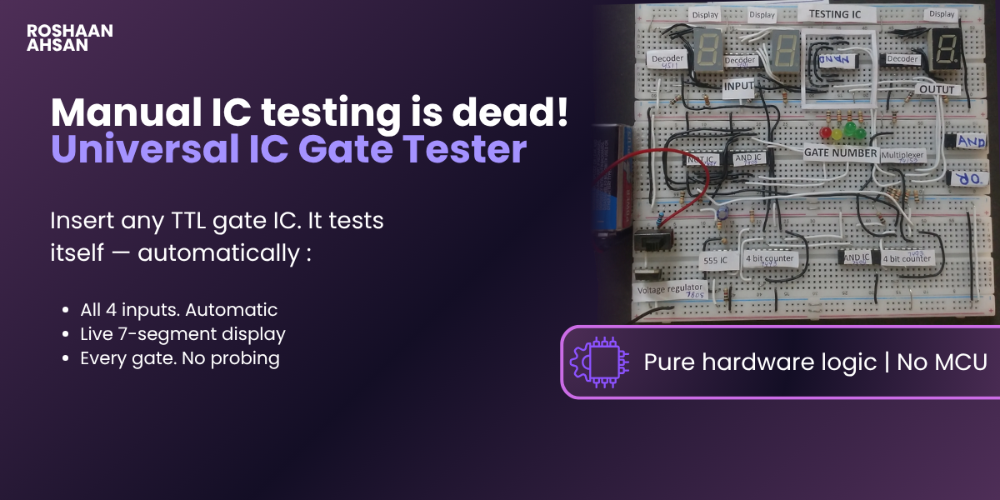
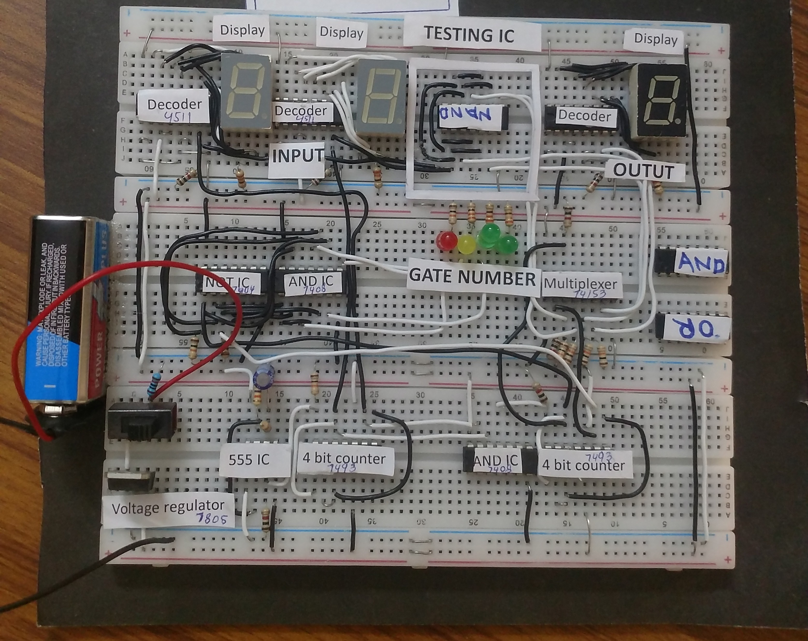
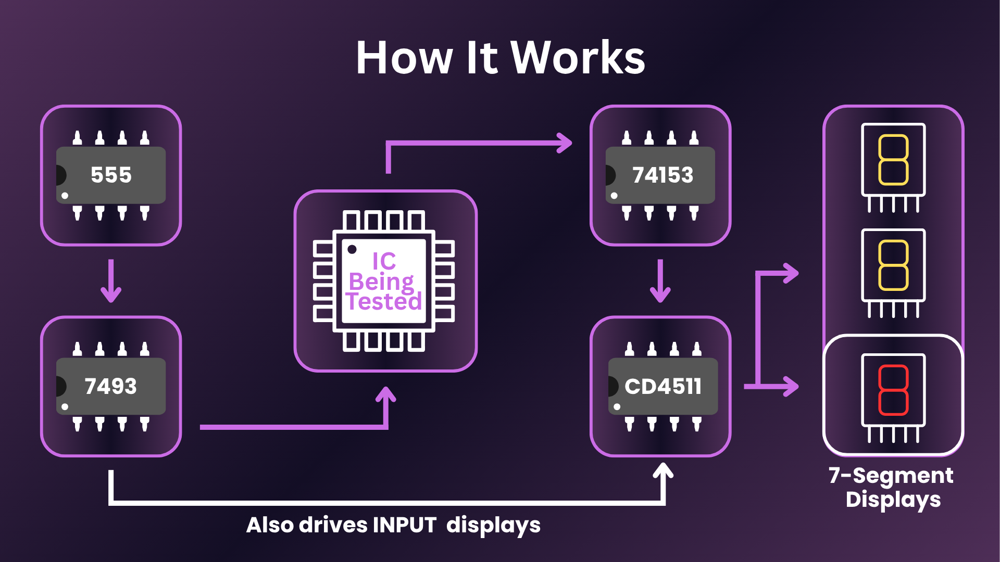
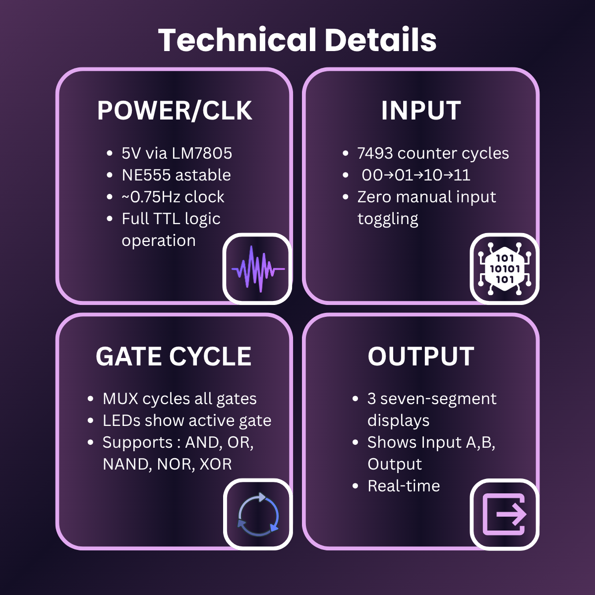
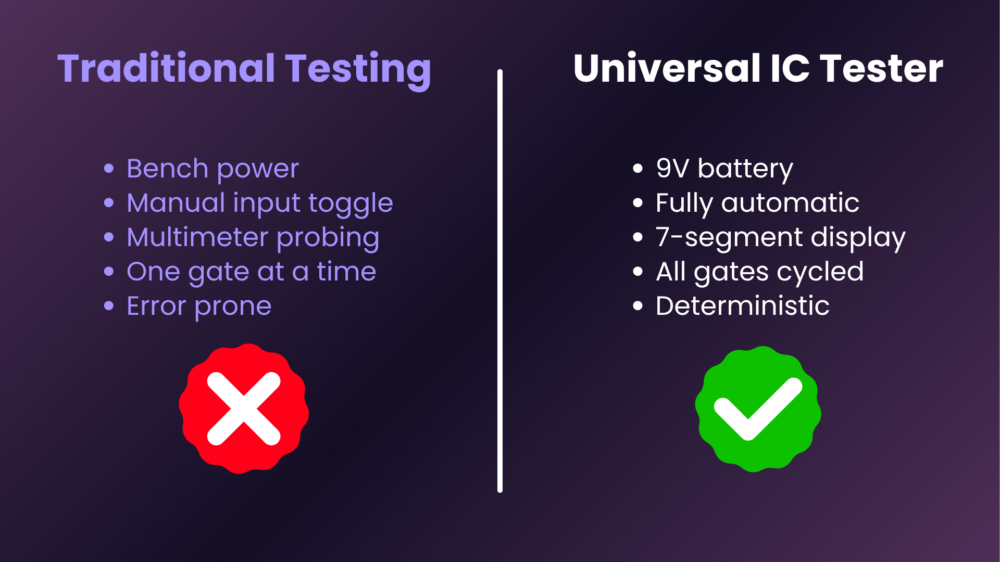

> **A fully automatic IC gate tester that cycles all 4 binary input combinations, displays real-time I/O on 7-segment displays, and sequences through every gate of a DIP IC — zero manual probing required.**

---

---

  

## Executive Summary

Engineers waste time manually testing IC gates with bench supplies and probes — this system automates the entire process. Insert any standard 2-input TTL gate IC, and it automatically sequences all four binary input combinations while displaying inputs and output live on 7-segment displays, cycling through every gate on the chip via LED indicators. Pure hardware logic. No microcontroller. No firmware.

---

## Real Hardware

  

---

## The Problem This Solves

| Manual Testing | This System |
|---|---|
| Bench power supply required | 9V battery — fully self-contained |
| Manual toggle of inputs A and B | Automatic — 555 + counter sequences all 4 combos |
| Read output with multimeter or probe | Live 7-segment display: Input A, Input B, Output |
| Test one gate at a time manually | Multiplexer auto-cycles through all gates on IC |
| Error-prone, slow, tedious | Deterministic, repeatable, instant |

---

## System Architecture

  

## Technical Stack

  

### Hardware — Silicon Layer

| Component | Part Number | Role |
|---|---|---|
| Clock Source | NE555 (Astable ~1Hz) | Generates timing pulses — human-readable speed |
| Input Sequencer | 7493 4-bit Counter | Generates 00 → 01 → 10 → 11 input combinations |
| Gate Selector | 74153 Multiplexer | Selects which gate of the DUT IC is under test |
| Display Driver | CD4511 BCD→7-Seg (×3) | Converts binary signals to 7-segment digits |
| Output Displays | 7-Segment Display (×3) | Shows Input A, Input B, Gate Output live |
| Gate Indicators | LED Array (Red + Green) | Illuminates to show active gate number |
| Power Regulation | LM7805 | Regulates 9V battery to stable 5V TTL logic level |
| Support Logic | 7408 AND, 7404 NOT | Signal routing and input conditioning |

### Supported ICs (Device Under Test)

Any standard TTL/CMOS 2-input, 1-output gate IC:

| IC | Gate Type |
|---|---|
| 7400 | NAND |
| 7402 | NOR |
| 7408 | AND |
| 7432 | OR |
| 7486 | XOR |
| 7404 | NOT (Hex Inverter) |

---

## Engineering Deep Dive

### Automated Input Generation
The fundamental problem is generating all four binary input states (00 → 01 → 10 → 11) automatically and repeatedly. I used the two LSBs (QA, QB) of a **7493 4-bit binary counter** clocked by a **NE555 in astable mode at ~1Hz** — this gives a clean, repeating 2-bit sequence covering the full truth table of any 2-input gate, at a speed slow enough for the human eye to read, without any microcontroller or firmware.

### Gate Cycling via Multiplexer
Most ICs have multiple gates on a single package (e.g. 7408 has 4 AND gates). The **74153 dual 4-to-1 multiplexer** routes the output of each gate sequentially to the display logic. The select lines of the multiplexer are driven by the upper bits (QC, QD) of the same counter — so gate cycling is fully automatic and perfectly synchronized with input sequencing. No extra control logic needed.

### Display Architecture
Three separate **CD4511 BCD-to-7-segment decoders** drive three displays simultaneously:
- **Display 1** — Input A (live)
- **Display 2** — Input B (live)
- **Display 3** — Gate Output (live)

The complete truth table entry being tested is visible at every clock cycle — no oscilloscope or multimeter needed.

### Power Architecture
9V battery → **LM7805** linear regulator → clean 5V rail for all TTL ICs. No external bench supply required. Fully self-contained and portable.

---

## Features

  
  &nbsp;

- **Fully Automatic Sequencing** — cycles all 4 input combinations without human intervention
- **Live 7-Segment I/O Display** — Input A, Input B, and Output shown simultaneously in real-time
- **LED Gate Indicator** — visual identification of which gate on the IC is currently under test
- **Self-Contained Power** — 9V battery + onboard LM7805 regulator, no bench supply required
- **Universal DUT Socket** — accepts any standard 2-input TTL/CMOS gate IC
- **Complete Truth Table Coverage** — all 4 binary combinations guaranteed per gate, per cycle
- **Pure Hardware Logic** — no microcontroller, no firmware, no software dependencies

---

## Project Context

Built in late 2025. Published 2026. Engineered to eliminate the manual, error-prone process of IC gate verification on the bench — a real problem every electronics engineer faces.

---

## Contact

